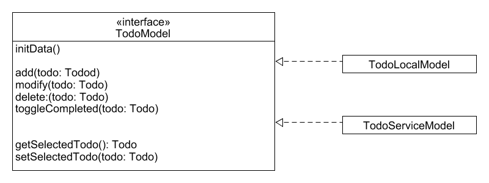
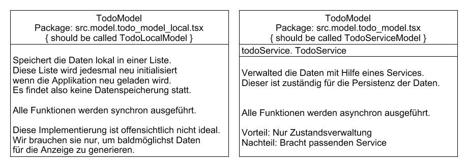
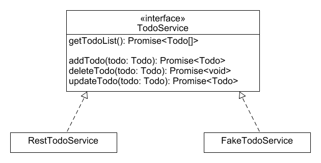
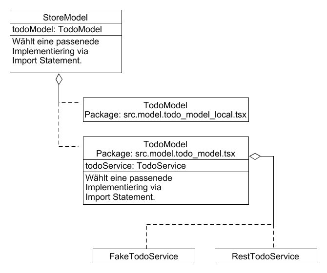

# Daten für die ToDo-Applikation

Wir werden die App schrittweise aufbauen und die Datenhaltung nach und nach verbessern.
Im ersten Schritt reicht es, wenn wir Daten haben für die Anzeige im GUI.  
Später werden wir für die Zustandsverwaltung einen Store einführen. Er wird uns die benötigte Funktionalität in einem ```TodoModel``` zur verfügung stellt.  
Wir werden das TodoModel zwei mal implementieren, einmal ohne Persistenz und einmal mit Hilfe eines Services, welcher die Datenpersistenz für uns erledigt.

## StoreModel
Das StoreModel enthält die verschiedenen Model die wir in unserer Applikation brauchen für die Zustandsverwaltung und das automatische Neuzeichnen der Applikation.  
In unserem Fall enthält es nur eine TodoModel-Instanz.

## TodoModel
Ein TodoModel implementiert alle benötigten Funktionen und verwaltet dabei den Zustand der Applikation bezüglich der vorhandenen ToDo's.  

Im Idealfall würden das folgendermassen aussehen:


Das Interface ermöglicht es uns, die Implementierung auszuwechseln, ohne dass der eigentliche Applikationscode betroffen ist.

### Problem: Synchrone versus asynchrone Ausführung
Wenn wir den Zustand lokal verwalten, können alle Datenoperationen **synchron** ausgeführt werden. Falls wir aber einen Service benutzen zur Datenspeicherung, haben wir das Problem. Wir schicken Daten oder Datenabfragen an einen externen Server. Von diesem werden wir gelegentlich informiert ob alles geklappt hat oder nicht. Anschliessend können wir die verlangten Daten in unseren Zustand übernehmen.  
Wir haben also zwangsweise eine **asynchrone** Ausführung des Codes.

Konkret bedeutet das, dass das locale TodoModel und das servicebasierte TodoModel nach aussen dieselbe Funktionalität anbieten müssen, die Signatur der Funktionen aber verschieden ist.  
Es ist desshalb nicht möglich, ein gemeinsammes Interface für beide Imlementierungen zu erstellen.

### Lösung: Synchrone versus asynchrone Ausführung
So now what?  
easy-peasy hilft. Wir können (müssen) die benötigten Funktionen via Store und StoreModel bei easy-peasy verlangen. easy-peasy gibt uns dann jeweils eine passende Proxyfuktion zurück, welche die Unterschiede von synchronen- und asynchronen Aufrufen vor uns versteckt.  
Wir können also zwei verschiedene Implementierngen schreiben solange die Grundfunktionalität in beiden Implementierungen identisch ist.

Da bleibt nur noch ein Problem. Wir haben kein gemeinsammes Interface und somit auch keinen gemeinsammen Namen welchen wir im aufrufenden Code benutzen können.  
Dieses Problem lösen wir über die Namensgebung. Sowohl das ```TodoLocalModel``` als auch
das ```TodoServiceModel``` implementiern wir als ```TodoModel```, jeweils mit einer eigenen, spezifischen Implementierung. Abhängig davon, welches der beiden wir importieren, können wir die Funktionalität anpassen.


## TodoService
Wir werden zwei Serviceimplementierungen schreiben. Erst den ```FakeTodoService``` welcher die Daten lokal verwaltet und dann den ```RestTodoService```, welcher die Daten auf einem externen Server ablegt.  

Da beide Implementierungen asynchron sind, können wir hier problemlos mit einem gemeinsammen Interface arbeiten.
  
Welche der beiden Implementierungen wir verwenden, legen wir wiederum über den Import fest.

# Übersicht über das StoreModel
Das untenstehende Diagramm gibt eine Übersicht über die bestehende Implementierung:
  
Beachten sie, dass sich die beiden TodoModel jeweils in einer eigenen Datei (Package) befinden und dass von den gestrichelten Agregationen jeweils nur eine gültig ist.