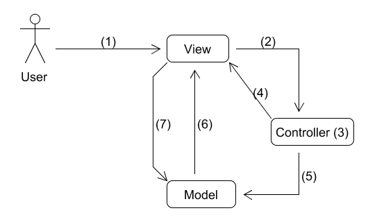
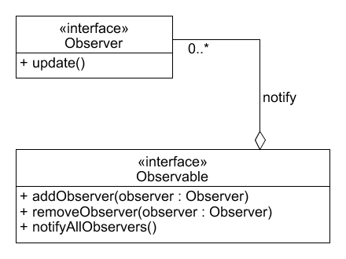
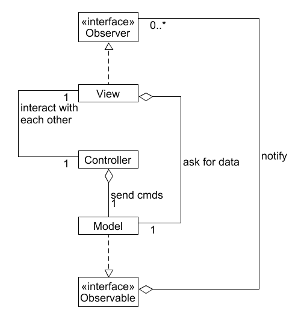
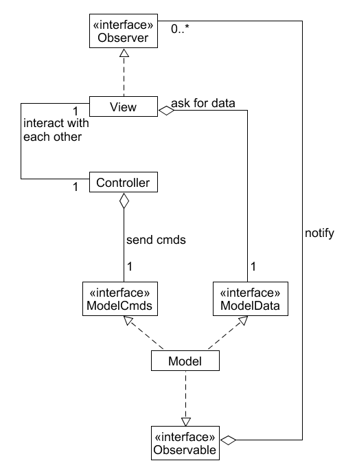
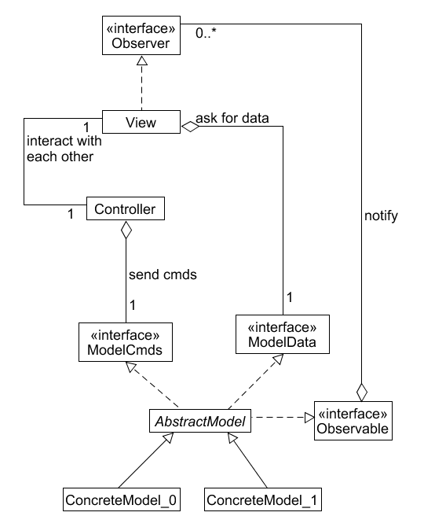

# MVC (Model View Controller)
MVC ist ein Pattern, also eine Art zu Denken. Es hilft uns, wenn wir eine Anwendung scheiben, die eine graphische Benutzerschnittstelle (ein Fenster) enthält.
Wir können die Applikation in drei logische Teile gruppieren. Das Model (die Applikation) , eine oder mehrere Views (die Fenster) für die Benutzerinteraktionen und je einen Controller pro View.
Die Zusammenarbeit zwischen diesen Komponenten können Sie sich etwa so vorstellen: 

Der Benutzer interagiert mit dem Fenster (1)
Das Fenster meldet diese Aktionen an den Controller (2)
Der Controller entscheidet, was diese Aktionen bedeutet (3).
Er kann die View veranlassen, ihren Zustand zu ändern (z.B. einen Button enablen / disablen) (4)
Er kann aber auch feststellen, dass in der Applikation irgendeine Funktionalität ausgelöst werden muss (5)
Wird die Applikation vom Controller benachrichtigt, dass es etwas zu tun gibt, führt sie den Befehl aus und benachrichtigt die View darüber, dass sich ihr Zustand geändert hat (6)
Die View fragt beim Model nach, was sich geändert hat und zeigt die Änderungen an (7)

## Vorteile des MVC Pattern
Ich möchte anmerken, dass das Wort Model etwas schwierig ist im Gebrauch. Viele Leute haben unterschiedliche Vorstellungen, was das Model ist und wie es implementiert werden soll. Lassen Sie mich das Model so definieren, dass das Wort für die Applikation steht welche die gesamte Busines-Logic  umfasst.
Der grosse Vorteil des MVC Patterns ist die Unabhängigkeit der einzelnen Komponenten voneinander. Man sagt, dass seine Komponenten untereinander nur „schwach gekoppelt“ sind.
Es wäre denkbar, eine View in einem anderen Programm wiederzuverwenden. Man müsste dazu nur den Controller auswechseln. Aus Sicht der View implementiert der Controller das Strategie Pattern.
Für den Controller ist es egal, welches Model er anspricht, solange das Model in der Lage ist, seine Befehle entgegenzunehmen.
Dem Model ist es egal, wer ihm Befehle schickt. Es führt diese einfach aus und benachrichtigt alle angemeldeten Views dass sich die Daten geändert haben.
Weiter ist es ihm egal, welche Views existieren und, was sie anzeigen und welche Benutzerinteraktionen sie anbieten solange sie über Zustandsänderungen informiert werden können.
Den Views wiederum ist es egal, welches Model sie visualisieren, solange das Model in der Lage ist, die benötigten Daten zu liefern. Die View selber ist nach dem Composite Pattern aufgebaut.
Die Verbindung zwischen dem Model und den Views kann mittels des Observer Pattern implementiert werden.

##	Implementierung des MVC Pattern
Als das MVC Patter erfunden wurde, war die Welt noch etwas komplizierter als heute. Views wurden typischerweise im Code zusammengebaut und gemäss dem Composite Pattern strukturiert. Heutzutage werden Views typischerweise deklarativ erstellt (mittels eines GUi-Builders zusammengeklickt) und zu Laufzeit dynamisch erzeugt. Ich werde deshalb das Composite Pattern nicht weiter erklären.
Die Idee, den Controller als Strategie Pattern zu implementieren kommt daher, dass man gedacht hat, dass es eine gute Idee ist, wenn man Code wiederverwendet. Das macht Sinn da das Programmieren von Views dazumal viel Arbeit machte.
Leider hat sich gezeigt, dass die Idee Objekte wiederzuverwenden schwieriger ist als gedacht. Die Erfahrung zeigt, dass nur etwa 3% aller erstellten Objekte wiederverwendet werden. Ich werde deshalb auf die Besprechung des Strategie Patterns verzichten.
Da bleibt nur noch ein Problem, nämlich die Kopplung zwischen dem Model und seine Views möglichst schwach zu koppeln. Dazu werden wir das Observer Pattern verwenden.

###	Observer Pattern
Das Observer Pattern besteht aus zwei Teilen, Dinge die überwacht werden können (Observable) und Dinge die benachrichtigt werden, wenn sich das überwachte Ding ändert (Observer).
Die Grundidee ist, dass sich Observer (Dinge die an Änderungen interessiert sind) bei einem Observer (das Ding das sich ändern kann) registrieren. Jedes Mal wenn sich der Zustand des Observable ändert, benachrichtigt es automatisch alle angemeldeten Observer darüber, dass eine Änderung stattgefunden hat.
Observer und Observable werden typischerweise als Interface definiert. Das hat den Vorteil, dass jedes Ding welches Observer implementiert (z. B. viele verschiedene Views) sich bei jedem Ding das Observable implementiert (z.B. dem Model) anmelden kann.
Auf diese Weise entkoppeln wir die Views elegant vom Model.

##	MVC für eine GUI-Applikation
 Wir haben vorhin gesagt, dass der Controller Befehle an das Model schickt. Das Model führt diese aus und benachrichtigt alle angemeldeten Observer darüber, dass Zustandsänderungen stattgefunden haben. Diese wiederum besorgen sich die neuen Daten beim Model und zeigen sie an.
Das Model muss also zwei Arten von Funktionalität bieten. Befehle entgegennehmen und Daten ausliefern.
Wenn wir wollen, können wir die beiden Funktionalitäten je in einem passenden Interface definieren. Unser Model muss diese dann einfach implementieren. Wir können dann noch einen Schritt weitergehen und das Model als abstrakte Klasse (oder als Interface) definieren, welches die beiden Interfaces implementiert. Der Vorteil wäre, dass die Modelimplementierung auswechselbar ist.
Halt Stopp denken Sie. Was? Weshalb soll ich verschiedene Versionen der Applikation schreiben wollen?
Ich gebe zu, dass dies eher selten vorkommen mag. Es ist aber denkbar, dass Sie eine Applikation schreiben die lokal auf Ihre Maschine läuft und eine, die die Funktionalität auf einem Server benutzt.
 Just kidding, we won’t do that Sam 
Bleibt also noch die Frage, ob wir ein Befehls- und Dateninterface benutzen sollen. Die lose Kopplung zwischen dem Controller und dem Model bringt nicht beliebig viel, zumal der Controller eh wissen muss, für welche Funktionalität er gebraucht wird. Das Schöne daran ist aber, dass man im Interface explizit steht, welche Funktionalität vorhanden ist.
Dasselbe gilt für das Model und seine Views. Views visualisieren bestimmte Aspekte der Applikation. Sie sind also sowieso Applikationsspezifisch. Nichts desto trotz gilt, dass es schön ist, wenn die Datenzugriffsfunktionen in einem Interface explizit sichtbar sind.
 
###	MVC Einfach
Das untenstehende UML-Diagramm zeigt die einfachste Möglichkeit das MVC Pattern zu implementieren. Falls nur eine einzige Art von View existiert, könnte man sich sogar noch die Observer-Interfaces sparen.

 
###	MVC optimal
Im untenstehenden UML-Diagramm sind die Fähigkeiten des Models durch die beiden Interfaces vorgegeben. Dieser Ansatz erhöht die Lesbarkeit des Designs. Dies ist meine bevorzugte Art, MVC zu implementieren.
 
 
###	MVC mit maximaler Abstraktion
Das untenstehende UML-Diagramm stellt die grösstmögliche Abstraktion dar. AbstractModel kann alle Funktionen des Interface Observable implementieren. Gleichzeitig dient es als Vorlage für verschiedene konkrete Implementierungen der Applikation.

