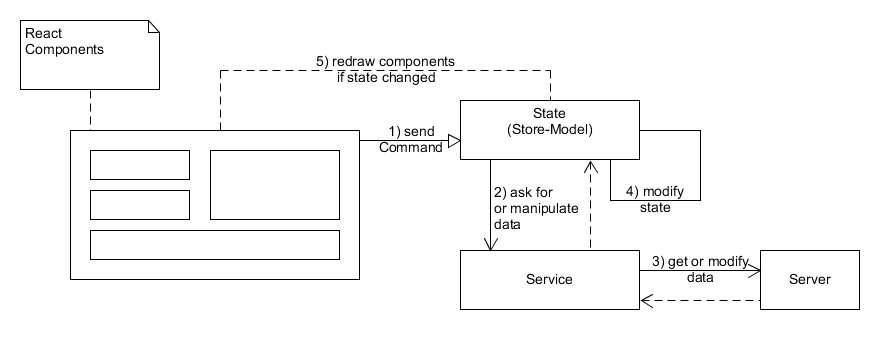

# Aufbau einer React Applikation

Eine Reactapplikation wird mit Vorteil folgendermassen aufgebaut:


## Zustandsverwaltung in React

Wir unterscheiden zwischen einem globelan Zustand welcher die vorhandenen Daten enthält und einem lokalen Zustand welche alle Daten und Funktionalität enthält die wir zur anzeige unserer Komponenten brauchen.

## Globale Daten

Den globalen Daten werden wir mittels eines Todo-Service verwalten.
Der Todo-Service hält die Daten im Client (unserer SPA-Applikation) bereit und synchronisiert sie ggf. mit einem Server (Backend).

## Applikationszustand
Der Applikationszustand gewährt uns den Zugriff auf die globalen Daten und stellt die benötigten Funktionalitäten bereit, die wir brauchen, um unsere Komponenten erstellen können. Jede Zustandsänderungen im Applikationszustand führt zu einem Neuzeichnen aller Abhängigen Komponenten.

### easy-peasy
Den Applikationszustand (State) werden wir [easy-peasy](https://easy-peasy.now.sh/) verwalten.
Mittels easy-peasy implementieren wir eine Store-Model, welcher unseren Komponenten die Daten zur Verfügung stellt. Im Unterschied zu [MVC](./overview_mvc.md) (Model View Controller) führen Änderungen in unserem Store-Model automatisch zu einem Neuzeichnen der abhängigen Komponenten. Man nennt das [reactive programming](https://de.wikipedia.org/wiki/Reaktive_Programmierung).

easy-peasy versorgt uns mit allem was wir brauchen:
* Abgeleiteter Zustand
* Remote-Datenzugriff / Persistenz
* Automatisches Caching für Leistungsoptimierung
* Einfaches mutationsbasierte API, welches Datenänderungen automatisch in unveränderliche Updates konvertiert
* [React Hooks](https://reactjs.org/docs/hooks-intro.html) um sie mit unseren Komponenten zu verwenden
* Volle [Redux](https://redux.js.org/)-Interoperabilität (einschließlich [Redux Dev Tools](https://chrome.google.com/webstore/detail/redux-devtools/lmhkpmbekcpmknklioeibfkpmmfibljd?hl=de))

Kurz gesagt, easy-peasy ist die Einfachste Art React mit Redux zu vereinen und dabei möglicht wenig Code zu schreiben.

# Übersicht easy-peasy

Als Erstes installieren Sie easy-peasy:
```
npm install easy-peasy
```

## Store & StoreModel
Als erstes erstellen wir einen Store. Ein Store wird definiert durch ein StoreModel. Das StoreModel seinerseits legt fest, welche Datenmodel wir brauchen. In unserem Falle besteht das StoreModel nur aus dem TodoModel.
Das muss aber nicht so sein. Wenn wir noch User hätten, würde das StoreModel auch noch ein UserModel enthalten.

Erstellen Sie die Datei [StoreModel.tsx](../src/store/StoreModel.tsx). Und copieren Sie den folgenden Code:

/src/store/StoreModel.tsx
```javascript
import { createStore, createTypedHooks } from 'easy-peasy'
import { TodoModel, todoModel } from '../model/todo_model'

// StoreModel may contain several Models
interface StoreModel {
    todoModel: TodoModel;
}

// Create the store 
const store = createStore<StoreModel>({
    todoModel: todoModel 
})

export default store

// Create typed hooks to interact with the store
// This is boilerplate code to create typescript information
const { 
    useStoreActions,
    useStoreDispatch,
    useStoreState,
} = createTypedHooks<StoreModel>()

export { useStoreActions, useStoreDispatch, useStoreState }
```
Dies ist der boiler-plate-code für easy-pasy. Nicht schlecht im Vergleich mit dem was wir schreiben müssen wenn wir Redux direkt benutzen würden.

Wir müssen unsere Applikation noch in einen StoreProvider einwickeln. Öffenen Sie [index.tsx](../src/index.tsx) und passen Sie den Code folgendermassen an:

/src/index.tsx
```javascript
ReactDOM.render(
  <StoreProvider store={store}>
    <React.StrictMode>
      <Router>
        <TodoApp />
      </Router>
    </React.StrictMode>
  </StoreProvider>,
  document.getElementById('root')
);
```

## TodoModel
In der Datei [todo_model.tsx](../src/model/todo_model.tsx) legen wir fest, welche Daten wir brachen und welche Funktionalität existiert.

Für den Moment reicht eine Liste von Todos und die Fähigkeit ein Todo zu löschen, bzw. das completet-Flag zu setzen.

../src/model/todo_model.tsx
```javascript
import { Action, action } from 'easy-peasy'

import Todo from './todo'
import todos from '../repository/simple_todo_repository'

export interface TodoModel {
    todos: Todo[]

    // Actions
    delete: Action<TodoModel, Todo>
    toggleCompleted: Action<TodoModel, Todo>
}
````

Anschliessend erstellen wir ein Objekt welches TodoModel implementiert:

../src/model/todo_model.tsx
```javascript
const todoModel: TodoModel = {
    todos: todos,

    delete: action((state, todo) => {
        for( var i = 0; i < state.todos.length; i++){ 
            if ( state.todos[i].id === todo.id) {
                state.todos.splice(i, 1); 
            }
         }
    }),

    toggleCompleted: action((state, todo) => {
        for( var i = 0; i < state.todos.length; i++){ 
            if ( state.todos[i].id === todo.id) {
                state.todos[i].completed = !state.todos[i].completed
            }
         }
    })
}

export { todoModel }
```
Wir werden das TodoModel später bei Bedarf erweiterm und anpassen.

# Verwenden des Store

Unsere TodoList-Komponente braucht Daten vom store. Passen Sie den Code folgendermassen an:

/scr/component/todo/TodoList.tsx
```javascript
// 1) import the store
import { useStoreState } from "../../store/StoreModel";

const TodoList: React.FC = () => {
    // 2) Get the data from the store
    const todoList = useStoreState(state => state.todoModel.todos)
    return(
        <List>
            {/* use the data to create TodoListItem
                Always use key={todo.id} because Lists need a unique key
            */}
            {todoList.map((todo) => 
                {return <TodoListItem key={todo.id} todo={todo}/>}
            )}
        </List>
    )
}
```

Die TodoListItem-Komponente bietet die Möglichkeit, Todos zu löschen und sie als erledigt zu markieren. Lassen Sie uns das auch noch erledigen:

/scr/component/todo/TodoList.tsx
```javascript
// 1) Import the store actions
import { useStoreActions } from "../../store/StoreModel";

interface TodoListItemProps {
    todo: Todo;
}

const TodoListItem: React.FC<TodoListItemProps> = ({todo}) => {
    // 2) Retrieve the delete action
    const deleteTodo = useStoreActions(actions => actions.todoModel.delete)
    // 3) Retrieve the toggle action
    const toggleCompleted = useStoreActions(actions => actions.todoModel.toggleCompleted)
    return(
        <ListItem >
            <ListItemIcon>
              <Checkbox
                edge="start"
                color='primary'
                checked={todo.completed}
                {/* 4) use the toggle action*/}
                onClick={() => { toggleCompleted(todo) }}
              />
            </ListItemIcon>
            <ListItemText primary={todo.title} />
            <ListItemSecondaryAction>
              <IconButton
                edge='end'
                color='secondary'
                {/* 5) use the delete action*/}
                onClick={() => { deleteTodo(todo) }}
              >
                <DeleteForeverIcon />
              </IconButton>
            </ListItemSecondaryAction>
        </ListItem>
    )
}
```
